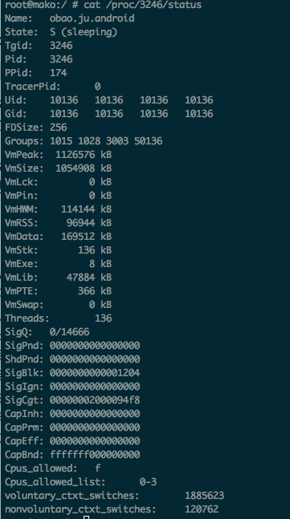

Title: Android内存分析和调优
Date: 2014-02-13 20:03
Category: android
Tags: 内存优化
Slug: android-memory

# Android内存分析和调优

### 内存相关名词解释：VSS/RSS/PSS/USS

- VSS Virtual Set Size 虚拟耗用内存（包含共享库占用的内存）
- RSS Resident Set Size 实际使用物理内存（包含共享库占用的内存）
- PSS Proportional Set Size 实际使用的物理内存（比例分配共享库占用的内存）
- USS Unique Set Size 进程独自占用的物理内存（不包含共享库占用的内存）

一般来说内存占用大小有如下规律：VSS >= RSS >= PSS >= USS

要优化内存，首先要做的就是分析内存占用情况。android提供了多个工具和命令进行内存分析

### 第一层 procrank命令

`adb shell procrank`

可以使用以下命令连续查看某一进程内存使用情况：

`while true; do procrank | grep com.taobao.ju.android; sleep 5; done `

它从/proc/pid/maps中读取信息来进行统计。源码位于：/system/extras/procrank;
该命令可以列出当前系统所有进程的内存占用情况，如：

```
PID       Vss      Rss      Pss      Uss  cmdline
24255  1058576K  126108K   84945K   79296K  com.zhihu.daily.android
23373  1088216K  102852K   63406K   59344K  com.alibaba.android.babylon
23777   966024K   92384K   61982K   58244K  com.tencent.mm
14729   995188K   99964K   61432K   55392K  com.netease.newsreader.activity
 3246  1054912K   96992K   59458K   54600K  com.taobao.ju.android
  605  1043552K   85772K   57351K   53724K  system_server
  693   961644K   72712K   46478K   43600K  com.android.systemui
14415   975220K   72012K   39411K   36548K  air.pioupiou
 9052   983784K   72528K   35451K   31268K  com.sina.weibo
27142   946320K   56992K   31705K   30204K  com.android.dialer
...
...
  169     1068K     484K     153K     148K  /system/bin/qcks
  165     1424K     144K     140K     140K  /sbin/healthd
  625     1048K     440K     129K     124K  /system/bin/efsks
  212      924K     328K     118K     116K  /system/bin/sh
  166     1000K     340K     114K     112K  /system/bin/servicemanager
  211     2116K     468K     107K      52K  /system/bin/qseecomd
 6943      868K     332K     107K     104K  wdaemon
31257      888K     316K      94K      92K  /data/data/com.estrongs.android.pop/files/libestool2.so
18647      856K     300K      90K      88K  /data/data/com.UCMobile/UCMobile/amodel/a
                           ------   ------  ------
                          981273K  886808K  TOTAL

RAM: 1878788K total, 77468K free, 138504K buffers, 596304K cached, 8420K shmem, 63432K slab
```

查看具体某一进程使用`cat proc/pid/status` 如：`cat /proc/3246/status`

- VmPeak: 表示进程所占用最大虚拟内存大小
- VmSize: 表示进程当前虚拟内存大小
- VmLck: 表示被锁定的内存大小
- VmHWM: 表示进程所占用物理内存的峰值
- VmRSS: 表示进程当前占用物理内存的大小(与procrank中的RSS)
- VmData: 表示进程数据段的大小
- VmStk: 表示进程堆栈段的大小
- VmExe: 表示进程代码的大小
- VmLib: 表示进程所使用共享库的大小
- VmPTE: 表示进程页表项的大小



通过procrank，只能很宏观的横向比较不同的应用。如果要更细致的了解具体内存是如何使用，则需要进入.


### 第二层 dumpsys meminfo

`adb shell dumpsys meminfo package.name`

执行结果：


### 第三层 adb shell showmap pid

该命令也是读取smaps文件，但结果细化的具体的vm area.

该命令输出的每行表示一个vm area，列出了该vm area的start addr, end addr, Vss, Rss, Pss, shared clean, shared dirty, private clean, private dirty，object。

第二层的dumpsys meminfo其实就是读取这些数据，然后分类（native, dalvik, .so map, etc.)统计生成。

- start addr和end addr表示进程空间的起止虚拟地址。
- Vss，Rss，Pss跟前面说的一样。
- Object可以看做mmap的文件名。
- Shared clean，按字面意思，表示共享的干净的数据。共享表示多个进程的虚拟地址可以都指向这块物理空间，表示多个进程共享的so库
- Private clean，包括该进程私有的干净的内存。包括前面说的该进程独自使用的so和进程的二进制代码段。
- Private dirty，表示该进程私有的不跟disk数据一致的内存段。


# 与Dalvik GC相关的属性

Logcat输出的log中，当垃圾回收器工作时，可以在Logcat中看到他的信息，类似于：

```
D/dalvikm( 14302): GC_CONCURRENT freed 2349K, 65% free 3246K/9551K, external 4703K/5261K, paused 2ms+2ms
```
其中D/dalvikvm表示由dalvikvm输出的调试信息，括号后的数字代表dalvikvm所在进程的pid.
在dalvik中，GC的类型有三种：

1. GC_EXPLICIT  
    应用主动调用System.gc()产生的GC事件
2. GC_FOR_ALLOC  
    内存分配时，发现可用内存不够时触发的GC事件
3. GC_CONCURRENT  
    当堆变得很大，防止出现堆溢出异常时产生
4. GC_FOR_MALLOC  
    如果GC_CONCURENT类型的操作没有及时运行，并且应用程序还需要分配更多内存时产生。
5. GC_EXTERNAL_ALLOC  
    外部内存分配失败时触发

`freed 2349K` 表示本次垃圾收集释放了2349K的内存。

`65% free 3246K/9551K` 其中9551K表示当前内存总量，3246K表示可用内存，65%表示可用内存占总内存的比例

`external 4703K/5261K` 表示可用外部内存/外部内存总量 

`paused 2ms+2ms` 第一个时间值表示markrootset的时间，第二个时间值表示第二次mark的时间。如果触发原因不是GC_CONCURRENT，这一行为单个时间值，表示垃圾收集的耗时时间


