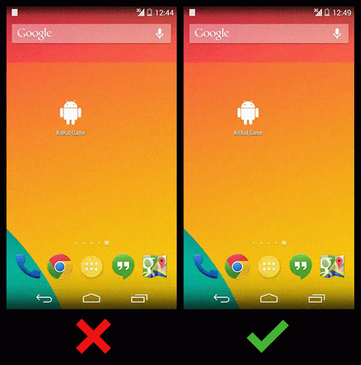

Title: 如何让Android应用启动的体验更顺畅
Date: 2014-05-29 20:34
Category: android
Tags: window
Slug: window_preview

## 如何让Android应用启动的体验更顺畅

Android 中应用启动的时候，首先会加载一个预览窗口（由Activity 的主题决定的）用于对用户操作的即时响应。一旦真正的内容加载完毕，预览窗口将淡出，内容窗口相应淡入。

Android应用window预览效果是打开的，可以通过`android:windowDisablePreview = true`来禁止window预览效果。

为了避免出现白色或黑色界面，可以通过修改activity的theme使启动过程更流畅。

## The perfect preview window

如果你的Activity没有ActionBar，那就在Activity 的主题里面禁用掉ActionBar，这样在预览窗口中就不会出现ActionBar了。

另外，因为默认的预览窗口是纯黑色的，如果你的Activity 背景是其他颜色，那么为了启动连贯顺畅，可以通过覆写window的背景颜色实现。如下:

1. 自定义主题，修改windowBackground

    
	    <style name="Theme.Calculator" parent=“@android:style/Theme.Holo.NoActionBar">
            <item name="android:windowBackground”>@android:color/black</item>
        </style>
    

2. Activity最外层的View不要设置android:background属性

```
<LinearLayout xmlns:android="http://schemas.android.com/apk/res/android"
    android:orientation="vertical"
    android:layout_width="match_parent"
    android:layout_height="match_parent"
    android:background="#ff000000">

    <!-- -->

</LinearLayout>
```

如果需要有ActionBar，则可以通过调整ActionBar的显示选项（displayOptions）比如显示和隐藏标题或者logo，来实现更顺滑的应用启动效果。 参考该[文档](http://developer.android.com/reference/android/R.attr.html#displayOptions)和[API指南](http://developer.android.com/guide/topics/ui/actionbar.html#Style)

> 注意，不要使用这个功能去实现Splash屏幕，这个的目的是为用户提供更流畅的应用体验，提供更和谐的转场效果。

更多信息，查看Cyril Mottier的[这篇文章](http://cyrilmottier.com/2013/01/23/android-app-launching-made-gorgeous/)




[原文链接](https://plus.google.com/+AndroidDevelopers/posts/VVpjo7KDx4H)