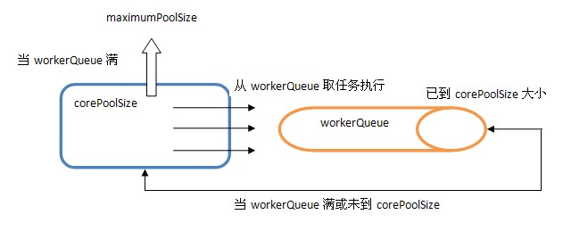

Title: ThreadPoolExecutor运转机制详解
Date: 2014-11-22 10:48
Category: java
Tags: Thread
Slug: ThreadPoolExecutor

# ThreadPoolExecutor运转机制详解

@(Java)[Thread|ThreadPool]

先看一下新建一个ThreadPoolExecutor的构建参数:

```java
public ThreadPoolExecutor(int corePoolSize,
                          int maximumPoolSize,
                          long keepAliveTime,
                          TimeUnit unit,
                          BlockingQueue<Runnable> workQueue,
                          ThreadFactory threadFactory,
                          RejectedExecutionHandler handler)
```

### 具体流程如下：

1. 当池子大小小于corePoolSize就新建线程，并处理请求

2. 当池子大小等于corePoolSize，把请求放入workQueue中，池子里的空闲线程就去从workQueue中取任务并处理

3. 当workQueue放不下新入的任务时，新建线程入池，并处理请求，如果池子大小撑到了maximumPoolSize就用RejectedExecutionHandler来做拒绝处理

4. 另外，当池子的线程数大于corePoolSize的时候，多余的线程会等待keepAliveTime长的时间，如果无请求可处理就自行销毁

### 内部结构如下所示：



> 从中可以发现ThreadPoolExecutor就是依靠BlockingQueue的阻塞机制来维持线程池，当池子里的线程无事可干的时候就通过workQueue.take()阻塞住。

`Executors`类使用`ExecutorService`提供了一个 `ThreadPoolExecutor`的简单实现，但 `ThreadPoolExecutor` 提供的功能远不止这些。我们可以指定创建 ThreadPoolExecutor 实例时活跃的线程数，并且可以限制线程池的大小，还可以创建自己的 RejectedExecutionHandler 实现来处理不适合放在工作队列里的任务.

其实可以通过`Executors`来学学几种特殊的ThreadPoolExecutor是如何构建的。

```java
public class Executors {
    
    public static ExecutorService newFixedThreadPool(int nThreads) {
        return new ThreadPoolExecutor(nThreads, nThreads,
                                      0L, TimeUnit.MILLISECONDS,
                                      new LinkedBlockingQueue<Runnable>());
    }
    public static ExecutorService newFixedThreadPool(int nThreads, ThreadFactory threadFactory){}
    public static ExecutorService newSingleThreadExecutor() {}
    public static ExecutorService newCachedThreadPool() {
        return new ThreadPoolExecutor(0, Integer.MAX_VALUE,
                                      60L, TimeUnit.SECONDS,
                                      new SynchronousQueue<Runnable>());
    }
}
```

`newFixedThreadPool`就是一个固定大小的ThreadPool.

`newCachedThreadPool`比较适合没有固定大小并且比较快速就能完成的小任务，没必要维持一个Pool，这比直接new Thread来处理的好处是能在60秒内重用已创建的线程。

其他类型的ThreadPool看看构建参数再结合上面所说的特性就大致知道它的特性