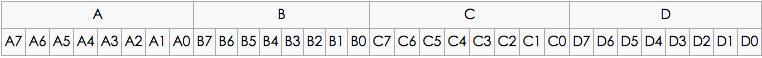
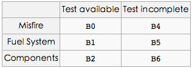
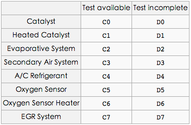
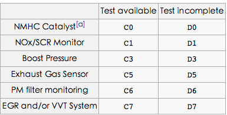
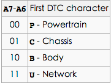
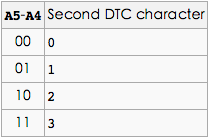
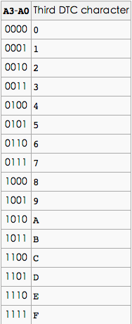

Title: OBD-II PIDs
Date: 2014-06-14 16:37
Category: vehicle
Tags: OBD
Slug: obd_ii_pids

## OBD-II PIDs

[OBD-II PIDs](http://en.wikipedia.org/wiki/OBD-II_PIDs)是用于从车辆请求数据的代码,用作诊断工具。

名词解释：

* DTC:  Diagnostic Trouble Codes       故障诊断码
* HEV:  hybrid electric vehicle        混合动力电动汽车
* MIL:  malfunction indicator lamp     故障指示灯
* ECU   Electronic Control Unit        电子控制单元

* BCD: Binary-Coded Decimal  二进制码十进制数或二-十进制代码，用4位二进制数来表示1位十进制数中的0~9这10个数码

## Modes：

| Mode (hex)     |     Description  |
| :--------: | :--------|
|01 | 显示当前数据|
|02 |显示冻结帧数据|
|03 |显示存储诊断故障代码|
|04 |清除诊断故障代码和存储值|
|05 |测试结果,氧传感器监测|
|06 |测试结果,其他组件/系统监控|
|07 |显示等待诊断故障代码|
|08 |控制电路板组件/系统的操作|
|09 |请求车辆信息|
|0A |清除故障诊断码|

## Standard PIDs：

**注意:** 

+ Modes 1和 Modes 2基本上是相同的,  除了Modes 1提供当前信息, 而Modes 2提供了上一次诊断故障代码被设置的时间点上相同数据信息的快照。
+ PID `01`是个例外只能在Mode 1中, PID `02`只能在Mode 2中。
+ 如果Mode 2 PID `02`返回零, 那么没有快照并且所有其他Mode 2的数据是没有意义的。

**Bit-Encoded-Notation:**

## Mode 01

#### **Mode 01 PID 01**

> 监测自DTCs清除后的状态。

`0101`这个PID的一次请求返回4个字节数据。

`第一字节A`包含两端信息:

`A7`:  MIL（检查发动机灯）是否点亮。
`A6-A0` :表示当前标记在ECU(电子控制单元)中诊断故障码的数量。

`第二(B)`，`第三(C)`和`第四(D)`字节给出某些车载测试的可用性和完整性。
需要注意：测试可用性被置位（1）bit标示；完整性被复位（0）bit标示。

| Bit      |     Name |   Definition   |
| :-------- | :--------:| :------ |
| A7    |   MIL   | 关或开，表示CEL/ MIL是否开启  |
| A6-A0 | DTC_CNT | 可用于显示确认排放相关故障码的数量|
| B7    | 保留字  | 保留的(应该为0) |
| B3    | *No Name* | 0 = 支持火花点火显示器 1 = 支持压缩点火显示器|

下面是`字节B`的通用定义：

`第三(C)`和`第四(D)`字节有不同的解释，这取决于发动机是火花点火还是压缩点火。
在`第二个（B）`字节中，`位B3`表示如何解释`C和D字节`，0是火花, 1是被压缩。

**当火花点火显示器时bytes C 和 bytes D：**

**当压燃式显示器时bytes C 和 bytes D：**

#### Mode 01 PID: 03

燃油系统状态，一次请求返回2个字节数据。
第一个字节描述了燃料系统＃1。

| Value      |     Description |
| :-------- | --------|
| 1    |开环由于发动机温度不足    |
| 2    |闭环，采用氧传感器的反馈来确定混合燃料   |
| 4    |开环由于发动机负荷或燃料因减速而切断  |
| 8    |开环由于系统故障   |
| 16   |闭合回路，使用至少一个氧传感器，但有一个故障在反馈系统  |

第二个字节描述燃料系统＃2（如果存在的话），并且是第一个字节相同的编码。

## Mode 02
> Mode 02接受Mode 01相同的PID，并且具有相同的意义，但返回的信息是冻结帧创建时的信息

你必须在消息的数据部分发送帧号。

#### Mode 02 PID: 02
引起冻结帧被存储的故障诊断码

## Mode 03 (无PID要求)
> 请求故障码

该模式的一次请求返回已设定的**故障码列表**。该列表是使用[ISO15765-2协议](http://en.wikipedia.org/wiki/ISO_15765-2)进行封装。
如果有小于等于两个DTCs(4 bytes)，那么他们是在ISO-TP单帧（SF）中返回。
列表中三个及以上的DTCs报告在多个帧中，以帧的精确计数依赖于该通信的类型和寻址的详细信息。

每一个故障码需要`2个字节`(AB)来描述。故障代码的文本描述可以如下进行解码。
在故障代码的`第一个字符`是由第一个字节的前两位决定：

以下四个位数是BCD编码。在DTC中的第二个字符是数字由下表定义：

在DTC中的第三个字符是数字被定义为：

在DTC中的`第四`和`第五`字符和第三字符的定义方式一样，但使用bits `B7-B4`和`B3-B0`。
由此产生的五个字符的代码应该看起来像`U0158`，可以对照OBD-II DTCs表查看。

十六进制字符（0-9，AF），而比较少见的，是允许在代码本身的最后3个位置。

**Enumerated PIDs**

某些PID是被专门解释，并且不一定恰好逐位编码的，或以任何比例。对于这些PID值被列举出来

## Mode 04

> 清除故障码/关闭故障指示灯（MIL）/检查发动机灯
> 清除所有存储的故障码和关闭故障指示灯。